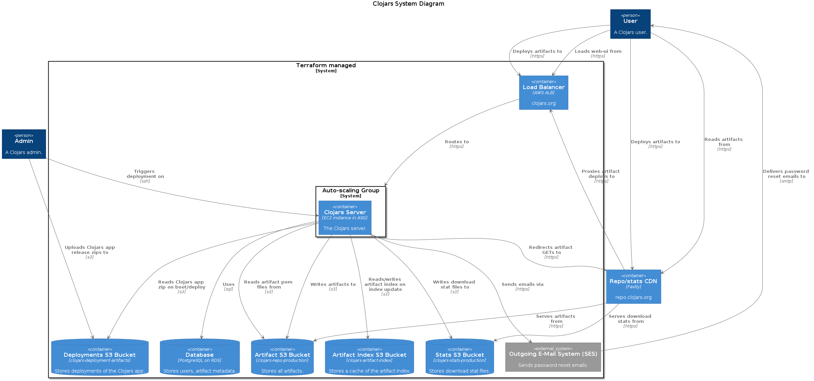

# Clojars Server Config

This repo contains the Ansible config for building the AMI for the
Clojars server, the terraform for managing the Clojars
infrastructure on AWS, and scripts to deploy a Clojars release.

# System Diagram



# Setup

## AWS Credentials

You will also need a AWS access key, exported as `AWS_ACCESS_KEY_ID`
and `AWS_SECRET_ACCESS_KEY`. These vars need to be set to run
terraform, build an AMI, or deploy. You will also need to set
`CLOJARS_SSH_KEY_FILE` to the path to the private key used by the
server if you want to deploy or ssh in to the server.

## Terraform

You will need terraform installed to be able to apply changes to the
infrastructure: https://www.terraform.io/downloads.html (currently
using v0.12.19).

### Initialization

The terraform state is stored in S3 and uses a DynamoDB table to lock
that state when it is being altered. On first run, you will need to
initialize terraform with:

```sh
cd terraform
terraform init
```
### Applying the configuration

```sh
cd terraform
terraform apply
```

## Packer

You will need packer installed to be able to build AMIs:
https://www.packer.io/downloads.html (currently using v1.5.4).

## Private Vars

There is some config for Clojars which is sensitive and cannot be
publicly shared in the Github repo. This is placed in
`aws-ansible/private/vars.yml`. For development purposes,
`aws-ansible/private_vars.yml.example` is a vars file which looks like
the real one but with sensitive information replaced. These vars are
used by the ansible that builds the AMI.

# Listing running instances

There is a convenience script to list all EC2 instances:

`scripts/list-instances.sh`

# Deployment

To deploy a new release of Clojars, you have a few options:

- You can build and upload a new release to S3, then deploy a new AMI
  that will pick up the release (see below)
- You can build and upload a new release to S3, then request that a
  running server switch to that release
- You can also switch back to an older release

To build and upload a new release, run:

`scripts/upload-release.sh <version-tag>`

This will check to see if an artifact for that tag already exists in
the deployment bucket. If not, it will pull down the tag from GitHub,
build an uberjar, then upload a zip containing that uberjar and the
`scripts/` dir from `clojars-web` to the deployment bucket. 

It then writes a `current-release.txt` containing the tag to the
deployment bucket.

To deploy a release to a running server, run:

`scripts/deploy.sh <server-ip> <version-tag>`

This will first call `scripts/upload-release.sh`, then ssh to the
server and run the [deploy-clojars
script](./aws-ansible/roles/clojars/files/bing-scripts/deploy-clojars). This
script will pull down the version specified by `current-release.txt`
and deploy it. This script is the same script that runs when the
Clojars AMI boots.

# Building an AMI

We build a custom AMI using packer, and apply changes to the AMI with
ansible. To run packer, call:

`scripts/build_ami.sh`

This will take a few minutes, but will produce a new AMI. See the
final output from packer to get the AMI ID.

# Deploying a new AMI

1. Edit `terraform/main.tf`, setting the `image_id` in the
   `prod_launch_config` to the new AMI. AMI changes to a launch
   configuration don't affect *running* instances, so we will have to
   force a new instance.
2. Edit `terraform/main.tf`, setting the `desired_capacity` and
   `max_size` to `2` for the `prod_asg`. 
3. Run `terraform apply`. This should cause a new instance to be
   created in the ASG (there will now be two). 
4. Wait for that new instance to be fully available, then edit
   `terraform/main.tf`, setting the `desired_capacity` and `max_size`
   back to `1` for the `prod_asg`.
5. Run `terraform apply`. This should cause the *oldest* instance to
   be shut down.

## Ansible Guidelines

* Follow Ansible [best practices](http://docs.ansible.com/ansible/playbooks_best_practices.html)
* Add an `{{ ansible_managed }}` comment in the header of all templates and files
* Place any private files in `aws-ansible/private/`


Distributed under the MIT License. See the file COPYING.
